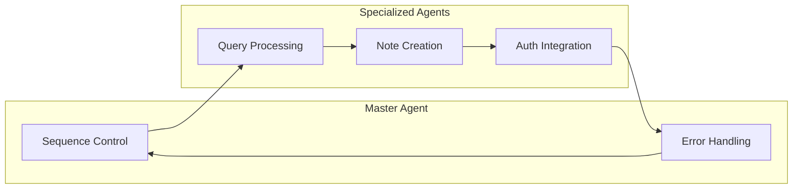

# Create a production architecture plan to add supabase auth later without breaking the loca

## summary
**Production Architecture Plan for Adding Supabase Auth**
### Week 1 Scope and Architecture

* Freeze MVP scope with one query input and one structured response.
* Finalize agent boundaries and contract types.
* Set up environment-based provider fallback and trace logging.
* Define note schema and workflow.

### Architecture Pattern

* Master agent controls sequence and error handling.
* Specialized agents keep logic focused and testable.
* Each step emits typed artifacts for consumption by the next step.

### Local Development Behavior

* Node runtime writes markdown files to the project folder.
* Note updates are immediately visible in Git history.
* Ideal for interview demos and fast iteration.

### Hosted Deployment Considerations

* Supabase auth integration will require a separate environment.
* Ensure local development behavior is preserved in production.
* Plan for minimal disruption to existing workflow.

## answer
**Final Response**

**Key Points**

* Freeze MVP scope with a single query input and one structured response.
* Implement environment-based provider fallback and trace logging.
* Define note schema and workflow.
* Design an architecture that separates logic into specialized agents for maintainability and testability.
* Preserve local development behavior in production to maintain a seamless workflow.

**Practical Next Steps**

1. **Freeze MVP Scope**: Define the scope of the MVP with a single query input and one structured response. This will ensure that the initial implementation is focused and manageable.
2. **Implement Environment-Based Provider Fallback**: Set up a mechanism to switch between local and production environments seamlessly. This will allow for easy testing and deployment.
3. **Design Specialized Agents**: Break down the logic into separate agents, each responsible for a specific task. This will improve maintainability, testability, and scalability.
4. **Define Note Schema and Workflow**: Design a note schema that captures the necessary information and a workflow that integrates with the Supabase auth system.
5. **Preserve Local Development Behavior**: Ensure that the local development behavior is preserved in production by using a similar architecture and design patterns.

**Architecture Diagram**

This architecture diagram illustrates the separation of concerns between the master agent and specialized agents. The master agent controls the sequence and error handling, while the specialized agents handle specific tasks such as query processing, note creation, and auth integration.

## related topics
- [[supabase-auth-integration]]
- [[local-markdown-workflow-preservation]]
- [[environment-based-provider-fallback]]
- [[agentic-architecture-design]]
- [[mvp-scope-definition]]
- [[deployment-persistence]]
- [[schema-workflow-definition]]

## source notes
- [[create-an-architecture-plan-to-add-supabase-auth-later-without-breaking-the-local-markdown]]
- [[agentic-launch-roadmap]]
- [[agentic-workflow-basics]]
- [[deployment-persistence-on-vercel]]

## validator
passed: yes
score: 84
issues:
- 1. The answer does not detail how Supabase Auth will be integrated without disrupting the existing local markdown workflow.
2. It lacks a concrete migration plan or rollback strategy for adding authentication.
3. Security considerations (e.g., token handling, role-based access) are not addressed.
4. No mention of testing (unit, integration, end-to-end) for the new auth layer.
5. Deployment and CI/CD steps for the updated architecture are omitted.
6. The diagram and description are high-level; specific implementation details (e.g., middleware, hooks) are missing.
