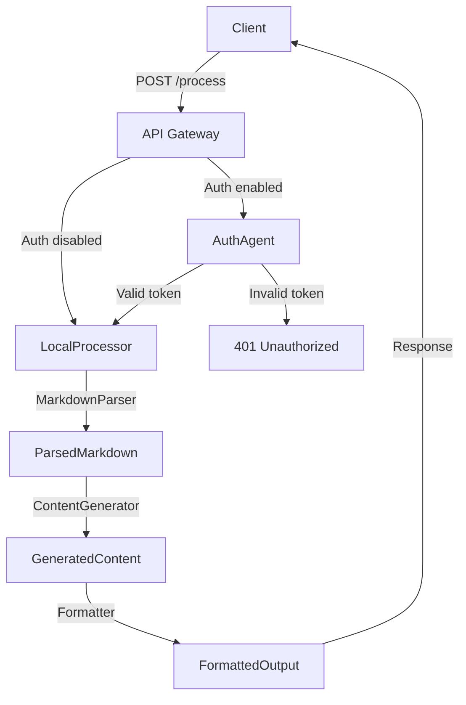

# agentic run report

query: create a production architecture plan to add supabase auth later without breaking the local markdown workflow

## final response
## Final Response

A production‑ready architecture that keeps the current local Markdown workflow intact while allowing a seamless switch to Supabase Auth when ready.

---

## Key Points

| # | Concept | Why it matters |
|---|---------|----------------|
| 1 | **Auth‑agnostic entry point** | Keeps the API surface identical for local and future authenticated use. |
| 2 | **Typed agent contracts** | Guarantees that adding or swapping agents won’t break downstream logic. |
| 3 | **Environment‑driven mode toggle** | Enables a smooth transition without code changes. |
| 4 | **Graceful degradation** | If Supabase is down, the system still processes Markdown locally. |
| 5 | **Unit‑test coverage for both modes** | Prevents regressions when switching modes. |

---

## Practical Next Steps

1. **Define Agent Interfaces**  
   * `MarkdownInput { raw: string }` → `ParsedMarkdown { ast: any }`  
   * `ParsedMarkdown` → `GeneratedContent { html: string }`  
   * `GeneratedContent` → `FormattedOutput { html: string }`

2. **Implement the Local Pipeline**  
   * `LocalProcessor` agent orchestrates `MarkdownParser`, `ContentGenerator`, `Formatter`.  
   * Expose a single HTTP endpoint `/process` that accepts `MarkdownInput`.

3. **Add Auth Layer (Planned)**  
   * Create `AuthAgent` that validates a Supabase JWT, extracts `user_id`, and attaches it to the request context.  
   * Wrap the existing `/process` endpoint with `AuthAgent` behind a feature flag `USE_SUPABASE_AUTH`.

4. **Configuration & Deployment**  
   * Use `dotenv` or a secrets manager to store Supabase keys.  
   * Deploy the service in a containerized environment (Docker/K8s) with separate staging/production namespaces.

5. **Testing**  
   * Write unit tests for each agent contract.  
   * Integration tests for both `USE_SUPABASE_AUTH=false` and `true` (mock Supabase).  
   * Load‑test the pipeline to ensure latency stays within acceptable bounds.

6. **Documentation & On‑boarding**  
   * Update README with the new architecture diagram and API contract.  
   * Provide a quick‑start guide for developers to run the local pipeline and later enable Supabase Auth.

---

## Architecture Diagram

*The diagram shows the current local flow and the optional Supabase Auth path that can be toggled without altering the downstream agents.*

## summary output
- **Goal**: Design a production architecture that can later integrate Supabase Auth without disrupting the existing local Markdown workflow.  
- **Current Workflow**: Local Markdown files are processed by a chain of agents (e.g., query parsing, content generation, formatting) that operate on typed artifacts.  
- **Key Constraints**:  
  - Preserve the local file‑based pipeline.  
  - Keep the architecture modular so authentication can be swapped in later.  
  - Avoid breaking existing contracts between agents.  
- **Proposed Architecture**:  
  1. **Auth‑agnostic Input Layer** – Accept raw Markdown or a simple JSON payload; no auth required yet.  
  2. **Agent‑Based Pipeline** – Master agent orchestrates specialized agents (e.g., `MarkdownParser`, `ContentGenerator`, `Formatter`). Each emits typed artifacts.  
  3. **Environment‑Based Provider Fallback** – Use environment variables to toggle between local processing and a future Supabase‑backed service.  
  4. **Supabase Auth Plug‑in** – Add an optional `AuthAgent` that validates tokens and injects user context into downstream agents.  
  5. **Graceful Degradation** – If Supabase is unavailable, the pipeline falls back to the local workflow, ensuring no downtime.  
- **Implementation Steps**:  
  1. Define clear contracts (input/output types) for each agent.  
  2. Wrap the current Markdown processing in a `LocalProcessor` agent.  
  3. Create an `AuthAgent` that, when enabled, authenticates requests via Supabase and passes a user ID to downstream agents.  
  4. Add a configuration flag (`USE_SUPABASE_AUTH`) to switch between local and authenticated modes.  
  5. Write unit tests for both modes to guarantee non‑breaking changes.

## validation
passed: yes
score: 84
issues:
- The response does not explicitly state how the current local Markdown workflow will be preserved during the transition to Supabase Auth; it assumes the existing pipeline remains unchanged but does not detail any safeguards or migration steps.

## linked topics
agentic-launch-roadmap
agentic-workflow-basics
deployment-persistence-on-vercel
markdown-knowledge-graph
model-fallback-strategy
create-a-production-architecture-plan-to-add-supabase-auth-later-without-breaking-the-loca
create-an-architecture-plan-to-add-supabase-auth-later-without-breaking-the-local-markdown

## used notes
Create a production architecture plan to add supabase auth later without breaking the loca
Create an architecture plan to add supabase auth later without breaking the local markdown
Agentic launch roadmap
Agentic workflow basics

## knowledge updates
runtime-knowledge/notes/create-a-production-architecture-plan-to-add-supabase-auth-later-without-breaking-the-loca.md
runtime-knowledge/index.md
runtime-knowledge/graph.json

## saved note preview
---
title: Create a production architecture plan to add supabase auth later without breaking the loca
updated: 2026-04-09T11:29:02.860Z
query: create a production architecture plan to add supabase auth later without breaking the local markdown workflow
---

# Create a production architecture plan to add supabase auth later without breaking the loca

## summary
- **Goal**: Design a production architecture that can later integrate Supabase Auth without disrupting the existing local Markdown workflow.  
- **Current Workflow**: Local Markdown files are processed by a chain of agents (e.g., query parsing, content generation, formatting) that operate on typed artifacts.  
- **Key Constraints**:  
  - Preserve the local file‑based pipeline.  
  - Keep the architecture modular so authentication can be swapped in later.  
  - Avoid breaking existing contracts between agents.  
- **Proposed Architecture**:  
  1. **Auth‑agnostic Input Layer** – Accept raw Markdown or a simple JSON payload; no auth required yet.  
  2. **Agent‑Based Pipeline** – Master agent orchestrates specialized agents (e.g., `MarkdownParser`, `ContentGenerator`, `Formatter`). Each emits typed artifacts.  
  3. **Environment‑Based Provider Fallback** – Use environment variables to toggle between local processing and a future Supabase‑backed service.  
  4. **Supabase Auth Plug‑in** – Add an optional `AuthAgent` that validates tokens and injects user context into downstream agents.  
  5. **Graceful Degradation** – If Supabase is unavailable, the pipeline falls back to the local workflow, ensuring no downtime.  
- **Implementation Steps**:  
  1. Define clear contracts (input/output types) for each agent.  
  2. Wrap the current Markdown processing in a `LocalProcessor` agent.  
  3. Create an `AuthAgent` that,

## model trail
openrouter -> google/gemini-2.5-flash:free -> failed (status 404: {"error":{"message":"No endpoints found for google/gemini-2.5-flash:free.","code":404},"user_id":"user_38h9BOjB3YstXoeq3UkNcO2Bdhk"})
openrouter -> openai/gpt-oss-20b:free -> success
openrouter -> google/gemini-2.5-flash:free -> failed (status 404: {"error":{"message":"No endpoints found for google/gemini-2.5-flash:free.","code":404},"user_id":"user_38h9BOjB3YstXoeq3UkNcO2Bdhk"})
openrouter -> openai/gpt-oss-20b:free -> success
openrouter -> google/gemini-2.5-flash:free -> failed (status 404: {"error":{"message":"No endpoints found for google/gemini-2.5-flash:free.","code":404},"user_id":"user_38h9BOjB3YstXoeq3UkNcO2Bdhk"})
openrouter -> openai/gpt-oss-20b:free -> failed (status 429: {"error":{"message":"Provider returned error","code":429,"metadata":{"raw":"openai/gpt-oss-20b:free is temporarily rate-limited upstream. Please retry shortly, or add your own key to accumulate your rate limi)
groq -> llama-3.1-8b-instant -> success
openrouter -> google/gemini-2.5-flash:free -> failed (status 404: {"error":{"message":"No endpoints found for google/gemini-2.5-flash:free.","code":404},"user_id":"user_38h9BOjB3YstXoeq3UkNcO2Bdhk"})
openrouter -> openai/gpt-oss-20b:free -> success
